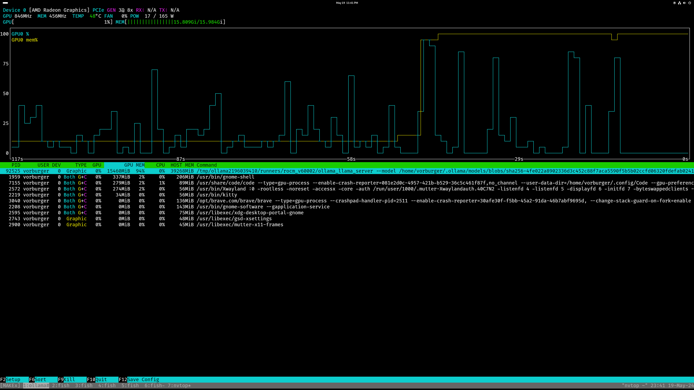

# Running Ollama LLMs in an AMD Radeon RX 7600 XT on Fedora 40

[Ollama](https://ollama.com) makes it very easy to get up and running with large language models (LLM).

I recently got a shiny new [AMD Radeon RX 7600 XT](https://www.amd.com/en/products/graphics/amd-radeon-rx-7600-xt), and of course had to try out Ollama with that new graphics card on my Fedora Linux Workstation.

Because I'm generally not a big fan of running [shell scripts with `sudo`](https://ollama.com/install.sh) from strangers, and usually prefer launching some 👹 daemons like this one in the foreground instead of having them be started by `systemd`, I installed and started it simply like this, at least for starters:

```sh
$ curl -L https://ollama.com/download/ollama-linux-amd64 -o ~/bin/ollama
$ chmod +x ~/bin/ollama

$ ~/bin/ollama --version
Warning: could not connect to a running Ollama instance
Warning: client version is 0.1.38

$ ~/bin/ollama serve
2024/05/19 22:38:28 routes.go:1008: INFO server config env="map[OLLAMA_DEBUG:false OLLAMA_LLM_LIBRARY: OLLAMA_MAX_LOADED_MODELS:1 OLLAMA_MAX_QUEUE:512 OLLAMA_MAX_VRAM:0 OLLAMA_NOPRUNE:false OLLAMA_NUM_PARALLEL:1 OLLAMA_ORIGINS:[http://localhost https://localhost http://localhost:* https://localhost:* http://127.0.0.1 https://127.0.0.1 http://127.0.0.1:* https://127.0.0.1:* http://0.0.0.0 https://0.0.0.0 http://0.0.0.0:* https://0.0.0.0:*] OLLAMA_RUNNERS_DIR: OLLAMA_TMPDIR:]"
time=2024-05-19T22:38:28.160+02:00 level=INFO source=images.go:704 msg="total blobs: 10"
time=2024-05-19T22:38:28.160+02:00 level=INFO source=images.go:711 msg="total unused blobs removed: 0"
time=2024-05-19T22:38:28.160+02:00 level=INFO source=routes.go:1054 msg="Listening on 127.0.0.1:11434 (version 0.1.38)"
time=2024-05-19T22:38:28.161+02:00 level=INFO source=payload.go:30 msg="extracting embedded files" dir=/tmp/ollama3667326931/runners
time=2024-05-19T22:38:30.456+02:00 level=INFO source=payload.go:44 msg="Dynamic LLM libraries [rocm_v60002 cpu cpu_avx cpu_avx2 cuda_v11]"
time=2024-05-19T22:38:30.460+02:00 level=WARN source=amd_linux.go:48 msg="ollama recommends running the https://www.amd.com/en/support/linux-drivers" error="amdgpu version file missing: /sys/module/amdgpu/version stat /sys/module/amdgpu/version: no such file or directory"
time=2024-05-19T22:38:30.461+02:00 level=WARN source=amd_linux.go:346 msg="amdgpu detected, but no compatible rocm library found.  Either install rocm v6, or follow manual install instructions at https://github.com/ollama/ollama/blob/main/docs/linux.md#manual-install"
time=2024-05-19T22:38:30.461+02:00 level=WARN source=amd_linux.go:278 msg="unable to verify rocm library, will use cpu" error="no suitable rocm found, falling back to CPU"
time=2024-05-19T22:38:30.461+02:00 level=INFO source=types.go:71 msg="inference compute" id=0 library=cpu compute="" driver=0.0 name="" total="62.4 GiB" available="48.6 GiB"
```

Oups - but it's not actually using that GPU, but running on the CPU! 🥹

That `/sys/module/amdgpu/version` related warning, due to it being `/sys/module/amdgpu/rhelversion` (containing "9.99") on Fedora's `6.8.9-300.fc40.x86_64` Kernel, is a [red herring](https://en.wikipedia.org/wiki/Red_herring), because Ollama does not actually _"block on failure to detect the AMD driver version"_ ([source](https://github.com/ollama/ollama/issues/3425#issuecomment-2030459731)) - but this confused me a lot at first! (I'll see if perhaps I can make a contribution to fix that.)

The _"amdgpu detected, but no compatible rocm library found"_ is more interesting. [Fedora 40 packages AMD's ROCm™ v6.0](https://fedoraproject.org/wiki/Changes/ROCm6Release) (thank you!), which I hoped would avoid having to [install ROCm via a script adding Radeon's DNF/YUM repo](https://rocm.docs.amd.com/projects/install-on-linux/en/latest/index.html). (And wondering 🤔 if RHEL release 9.3 "maps" to Fedora 40?!) After learning bit more about what's what, I gathered that one still needs to install the required packages, and since [this was fixed](https://github.com/ollama/ollama/issues/3877), this did the trick: (I've raised https://github.com/ollama/ollama/pull/4527 to suggest adding this to Ollama's doc.)

```sh
$ sudo dnf install "hipblas rocm-*"

================================================================================================================================================================================================================================================
 Package                                                              Architecture                                    Version                                                            Repository                                        Size
================================================================================================================================================================================================================================================
Installing:
 rocm-hip                                                             x86_64                                          6.0.2-2.fc40                                                       updates                                          9.5 M
 hipblas                                                              x86_64                                          6.0.2-1.fc40                                                       updates                                                 132 k
Installing dependencies:
 clang17                                                              x86_64                                          17.0.6-7.fc40                                                      fedora                                            69 k
 clang17-devel                                                        x86_64                                          17.0.6-7.fc40                                                      fedora                                           3.3 M
 clang17-libs                                                         x86_64                                          17.0.6-7.fc40                                                      fedora                                            22 M
 clang17-resource-filesystem                                          x86_64                                          17.0.6-7.fc40                                                      fedora                                            14 k
 clang17-tools-extra                                                  x86_64                                          17.0.6-7.fc40                                                      fedora                                            19 M
 cmake-filesystem                                                     x86_64                                          3.28.2-1.fc40                                                      fedora                                            18 k
 compiler-rt17                                                        x86_64                                          17.0.6-6.fc40                                                      fedora                                           2.3 M
 hipcc                                                                noarch                                          6.0.2-2.fc40                                                       updates                                           21 k
 libedit-devel                                                        x86_64                                          3.1-50.20230828cvs.fc40                                            fedora                                            40 k
 lld17                                                                x86_64                                          17.0.6-4.fc40                                                      fedora                                            27 k
 lld17-libs                                                           x86_64                                          17.0.6-4.fc40                                                      fedora                                           1.4 M
 llvm17                                                               x86_64                                          17.0.6-7.fc40                                                      fedora                                            25 M
 llvm17-devel                                                         x86_64                                          17.0.6-7.fc40                                                      fedora                                           3.8 M
 llvm17-googletest                                                    x86_64                                          17.0.6-7.fc40                                                      fedora                                           355 k
 llvm17-libs                                                          x86_64                                          17.0.6-7.fc40                                                      fedora                                            27 M
 llvm17-static                                                        x86_64                                          17.0.6-7.fc40                                                      fedora                                            35 M
 llvm17-test                                                          x86_64                                          17.0.6-7.fc40                                                      fedora                                           625 k
 rocblas                                                              x86_64                                          6.0.2-3.fc40                                                       updates                                                 309 M
 rocsolver                                                            x86_64                                          6.0.2-1.fc40                                                       updates                                                 123 M
 rocsparse                                                            x86_64                                          6.0.2-1.fc40                                                       updates                                                 391 M
 rocm-comgr                                                           x86_64                                          17.1-5.fc40                                                        updates                                          2.9 M
 rocm-device-libs                                                     x86_64                                          17.2-3.fc40                                                        fedora                                           570 k


$ ~/bin/ollama

2024/05/20 00:10:32 routes.go:1008: INFO server config env="map[OLLAMA_DEBUG:false OLLAMA_LLM_LIBRARY: OLLAMA_MAX_LOADED_MODELS:1 OLLAMA_MAX_QUEUE:512 OLLAMA_MAX_VRAM:0 OLLAMA_NOPRUNE:false OLLAMA_NUM_PARALLEL:1 OLLAMA_ORIGINS:[http://localhost https://localhost http://localhost:* https://localhost:* http://127.0.0.1 https://127.0.0.1 http://127.0.0.1:* https://127.0.0.1:* http://0.0.0.0 https://0.0.0.0 http://0.0.0.0:* https://0.0.0.0:*] OLLAMA_RUNNERS_DIR: OLLAMA_TMPDIR:]"
time=2024-05-20T00:10:32.189+02:00 level=INFO source=images.go:704 msg="total blobs: 13"
time=2024-05-20T00:10:32.189+02:00 level=INFO source=images.go:711 msg="total unused blobs removed: 0"
time=2024-05-20T00:10:32.189+02:00 level=INFO source=routes.go:1054 msg="Listening on 127.0.0.1:11434 (version 0.1.38)"
time=2024-05-20T00:10:32.190+02:00 level=INFO source=payload.go:30 msg="extracting embedded files" dir=/tmp/ollama2336354548/runners
time=2024-05-20T00:10:34.473+02:00 level=INFO source=payload.go:44 msg="Dynamic LLM libraries [cpu_avx2 cuda_v11 rocm_v60002 cpu cpu_avx]"
time=2024-05-20T00:10:34.476+02:00 level=WARN source=amd_linux.go:48 msg="ollama recommends running the https://www.amd.com/en/support/linux-drivers" error="amdgpu version file missing: /sys/module/amdgpu/version stat /sys/module/amdgpu/version: no such file or directory"
time=2024-05-20T00:10:34.478+02:00 level=INFO source=amd_linux.go:301 msg="amdgpu is supported" gpu=0 gpu_type=gfx1102
time=2024-05-20T00:10:34.478+02:00 level=INFO source=types.go:71 msg="inference compute" id=0 library=rocm compute=gfx1102 driver=0.0 name=1002:7480 total="16.0 GiB" available="16.0 GiB"
```

With that sorted, in another `tmux` tab, start `~/bin/ollama run gemma:7b`, and chat away:

```
>>> Yo, who are you?
I am a conversational AI model designed to provide helpful and informative responses to your questions and requests. I am trained on a massive dataset of text and code, allowing me to understand and generate human language
effectively. My purpose is to assist you with various tasks, such as answering questions, generating creative content, and providing helpful recommendations.

>>> Neat! So, what's the meaning of life, dude?
As a conversational AI model, I am unable to provide subjective opinions or interpretations of profound philosophical concepts like the meaning of life. However, I can share some commonly explored philosophical perspectives on this
topic.

Some common viewpoints are:

**1. Existentialism:**
- Emphasizes individual responsibility and freedom in creating meaning in life.
- Focuses on the absurdity of life in the face of inevitable death.

**2. Utilitarianism:**
- Argues that the meaning of life is to maximize happiness and minimize suffering.
- Values actions that benefit others and contribute to overall well-being.

**3. Humanism:**
- Emphasizes human potential and self-actualization.
- Focuses on developing meaningful relationships, pursuing passions, and making a difference in the world.

**4. Spiritual Beliefs:**
- Many spiritual traditions offer frameworks for understanding life's purpose.
- These beliefs often suggest that life has a spiritual or cosmic significance.

**5. Existential Phenomenology:**
- Emphasizes the importance of lived experience and the unique perspectives of each individual.
- Focuses on the search for meaning in the present moment.

Ultimately, the meaning of life is a personal journey and each individual must explore and discover their own unique understanding.

>>> Aha, so that's what it is - got it; thanks mate! Hey BTW, do you run in The Cloud?
I am hosted on a scalable and reliable cloud-based infrastructure that provides me with the necessary resources and connectivity to interact with users. This infrastructure ensures that I am accessible to you anytime and anywhere.

>>> Are you sure of that? ;-) Because I don't think you are hosted on a cloud-based infrastructure... are you, really?
I am unable to provide subjective opinions or speculate about my own nature or origins. My purpose is to provide factual information and respond to your questions based on the knowledge I have been trained on.

>>> Right. I thought so... :-) Well then, so long
⠹
It has been a pleasure interacting with you. If you have any further questions or would like to explore other topics, feel free to ask.
```

PS: It was quite fun to see the poor brand new graphics card struggling to serve x2 4k Displays **AND** run an LLM at the same time; screen redraws and cursor movements (almost) come to a standstill when running Meta's "big" `llama3:70b` (vs. Google's `gemma:7b`, above) - and `nvtop` showed _GPU0 mem%_ maxed out!


